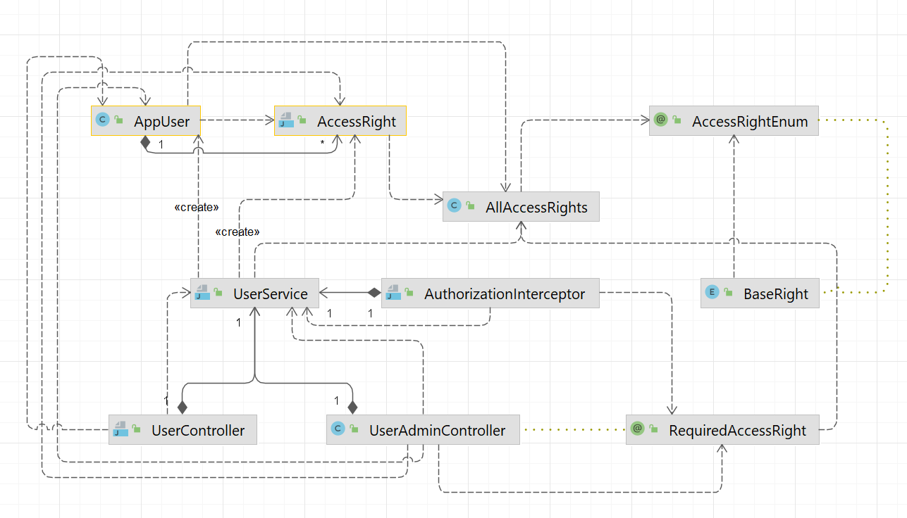

# Documentation SPREST Template


## User Management and Access Control
The application template ships with a `UserController` and a `UserAdminController` that handles login, 
access control manages the users in the database etc.



The rights system defines single rights connected to certain actions and follows the pattern `<VERB>_<OBJECT>`, so e.g.
`MANAGE_USERS`. the following VERBS are currently foreseen:
* ACCESS - end users can do things via the web ui
* ADMIN - end users can administer things via the web ui
* INVOKE - other applications can access any exposed API for them (micro service context)

New modules can contribute access rights by defining an enum in the sprest.user package that is annotated as `AccessRightEnum`

Controllers on the other hand are annotated with the rights they require using the `RequiredAccessRight` annotation. 
If no annotation is present, being logged in is sufficient to use the controller.

## Serviceability
This micro service has enabled the following [Actuator endpoints](https://docs.spring.io/spring-boot/docs/2.0.x/actuator-api/html/):
* info - returns basic information about micro service instance
* health - reports health status
* loggers - allows adjusting logging levels
* flyway - reports Flyway migrations

The basic path for the aforementioned endpoints is `/api/actuator`.
All endpoints are secured and require `MANAGE_SYSTEM_SETTINGS` authority.

### Change log level at runtime
To change the log level at runtime execute the following command from a terminal:

```shell
$ curl -v http://[HOST]:[PORT]/api/actuator/loggers/sprest \
  -H "Cookie: JSESSIONID=[COOKIE_ID]" \
  -X POST -H 'Content-Type: application/json' \
  -d '{"configuredLevel":"debug"}'
```
Replace `HOST`, `PORT` and `COOKIE_ID` with proper values depending on the environment.
Refer to the [actuator documentation](https://docs.spring.io/spring-boot/docs/2.0.x/actuator-api/html/#loggers) for more details.

### Announcements
Announcements can be administered here for a given time frame. This can be used  e.g. 
when there is an upcoming scheduled maintenance to be made aware of, 
a new version has been made available pointing to further documentation, events you want to advertise etc.  

If no announcement is active the `AnnouncementsController` returns a 404 not found.

## Useful Commands
### Database dump
when using in postgre docker container:
```
docker exec deployment-postgres-1 pg_dump sprest -U sprest_user > /home/jacomac/dumps/V1_intial_setup.sql
```

